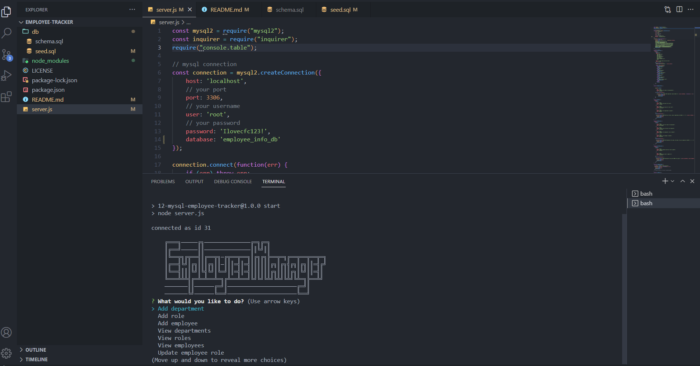

# employee-tracker

## Description

This application was made to allow a company to view departments, roles, workers and pay to help organzie and manage data. A user can view job departments within the company, salaries for certain roles, employee data with salary, id number and which manager they report to. If new jobs or employees come in the user can also add departments, roles and employees to the database.

## Table of Contents

- [Installation](#installation)
- [Usage](#usage)
- [License](#license)
- [Contributing](#contributing)
- [Tests](#tests)
- [Questions](#questions)

## Installation

To install, the user needs to clone the repo and have Node installed. Once that is done the user can run the command to use the generator.

## Usage

Video Walkthrough: https://app.castify.com/view/e7716906-74bb-4b4b-bf36-c061a6b021f1

You use the Inquirer from your command line and then click on whichever prompt you are interested in.

## License

This project is license under MIT

## Contributing

At this time there is no need to contribute.

## Tests

npm start

## Questions

If you have any questions, please email me at Tyler.Kand2@gmail.com. You can also view more of my work at https://github.com/TylerKandarian.
